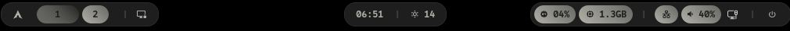
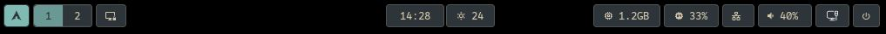
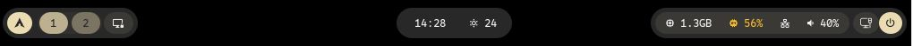

# custom — Hyprland theme & tooling

Temas **theme-prateado**, **theme-everforest**, **theme-gruvbox** e **theme-glass** para Waybar, Rofi, Foot e Hyprland.

## Preview

### theme-prateado



### theme-everforest



### theme-gruvbox



## Estrutura

```
custom/
├── theme-prateado/
├── theme-everforest/
├── theme-gruvbox/
├── theme-glass/
│   ├── theme.conf
│   ├── waybar/
│   ├── rofi/
│   └── foot/
└── scripts/
    ├── shot.sh
    └── rofi-theme.sh

binds.conf
current                  # tema ativo ($THEME)
current_theme.conf
waybar-current.sh        # exec-once → waybar do tema em current
install.sh
```

## Instalação

```bash
git clone git@github.com:amonetlol/custom.git
cd custom
./install.sh
```

No `hyprland.conf`:

```conf
source = ~/.config/custom/current_theme.conf
source = ~/.config/custom/binds.conf
exec-once = ~/.config/custom/waybar-current.sh
```

Trocar tema: **Super+T** (`rofi-theme.sh`) ou editar `~/.config/custom/current`.

## Hub (`rofi/hub.sh`)

Dispatcher central dos menus:

| Flag | Ação |
|------|------|
| `--menu` | Launcher (drun) |
| `--applet` | Menu sistema |
| `--clip` | Clipboard |
| `--wall` | Wallpaper (awww) |
| `--power` | Power menu |
| `--window` | Window switcher |
| `--foot` | Terminal foot |
| `--waybar` | Reinicia waybar |

## Hub GUI (`rofi/hub-gui.sh`)

Menu Rofi com nomes legíveis para as ações do hub.

## Atalhos (`binds.conf`)

| Atalho | Ação |
|--------|------|
| Super+D | Launcher |
| Super+F11 | Hub GUI |
| Super+F12 | Reiniciar waybar |
| Super+F10 | Wallpaper |
| Super+T | Seletor de tema |
| Alt+V | Clipboard |
| Super+X | Power menu |
| Super+Shift+D | Window switcher |
| Super+Shift+R | `hyprctl reload` |
| Super+Return | Foot |
| Super+Shift+Return | Foot flutuante |
| Super+E | Thunar |
| Super+W | Firefox |
| Super+F | Fullscreen |
| Print | Screenshot tela |
| Super+Print | Screenshot área |

## Dependências

- hyprland, waybar, rofi, foot, awww, wttrbar
- cliphist, wl-clipboard, pamixer ou wpctl
- hyprlock, brightnessctl (opcional)
